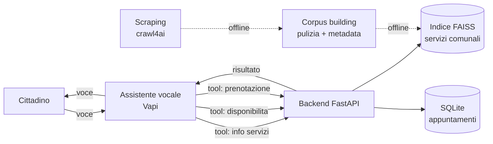

# Architettura

## Flusso di una conversazione

Il cittadino parla con l'assistente vocale. L'assistente trascrive, interpreta e, quando serve un
dato reale, chiama un tool che punta al backend. Il backend risponde e l'assistente pronuncia il
risultato.

## Componenti

- **Assistente vocale (Vapi)**: trascrizione con Deepgram in italiano, modello linguistico GPT-4o,
  voce italiana, instradamento verso i tool.
- **Backend (FastAPI)**: espone gli endpoint chiamati dai tool. Contiene il recupero semantico dei
  contenuti e la logica degli appuntamenti. Non contiene un modello generativo.
- **Indice dei servizi (FAISS)**: costruito offline a partire dai contenuti del sito comunale.
- **Database appuntamenti (SQLite)**.

## Dall'acquisizione all'indice (offline)

La preparazione dei contenuti avviene una volta sola, fuori dal runtime, in due fasi distinte:

- **Scraping**: estrazione del contenuto grezzo delle pagine del sito comunale (crawl4ai).
- **Corpus building**: trasformazione del contenuto grezzo in una base testuale pulita. Si rimuovono
  menu e parti ripetute, si normalizza il testo, si eliminano i duplicati, si tiene solo il
  contenuto in italiano e si registra per ogni unità la fonte e la sezione di provenienza.

Il corpus pulito è un artefatto intermedio (testo più metadati). Da lì il contenuto viene diviso in
blocchi, trasformato in vettori con un modello di embedding multilingue e salvato nell'indice FAISS.

Pipeline completa: **scraping → corpus building → suddivisione in blocchi → embedding → indice**.

## Recupero in fase di conversazione

A ogni domanda, la domanda viene vettorizzata e si recuperano i blocchi più vicini per similarità.
I blocchi recuperati vengono restituiti all'assistente, che li usa per formulare la risposta parlata.

## Contratto dei tool

Per ogni chiamata, Vapi invia al backend un messaggio che contiene l'elenco delle chiamate tool, con
nome e argomenti. Il backend risponde con un elenco di risultati, ciascuno associato
all'identificativo della chiamata ricevuta.

## Separazione tra recupero e generazione

Il backend recupera i passaggi pertinenti; la formulazione della risposta resta all'assistente
vocale, che ha già un modello linguistico in linea durante la chiamata. Questo evita una seconda
chiamata a un modello generativo e mantiene la logica del backend semplice e testabile in isolamento.
Le ragioni di questa scelta sono in [DECISIONS.md](DECISIONS.md).

## Controlli di qualità

Il sistema prevede controlli a ogni stadio, non solo a fine processo.

- **Corpus building**: si scartano pagine vuote o troppo brevi, si tiene solo il contenuto in
  italiano, si rimuovono duplicati e parti ripetute; ogni unità conserva fonte e data.
- **Indicizzazione**: si verifica che l'indice si carichi, che il numero di blocchi sia quello
  atteso e che una query di prova restituisca risultati.
- **Recupero**: si applica una soglia di similarità. Se il risultato migliore è sotto la soglia,
  l'assistente dichiara che l'informazione non è disponibile invece di restituire contenuto poco
  pertinente. È il controllo principale contro le risposte non fondate.
- **Confine dei tool**: gli argomenti in ingresso sono validati per tipo e formato; le richieste
  malformate vengono rifiutate; le chiamate hanno un timeout.
- **Appuntamenti**: si verifica che data e ora siano valide e future e che lo slot esista; un
  controllo impedisce la doppia prenotazione dello stesso slot.
- **Prima della consegna**: i test e un piccolo insieme di domande e risposte di riferimento devono
  passare.
