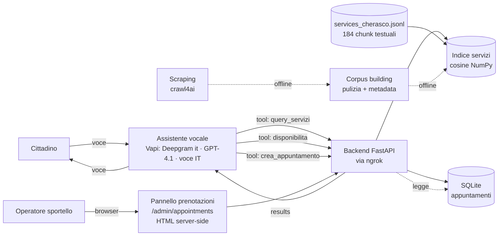
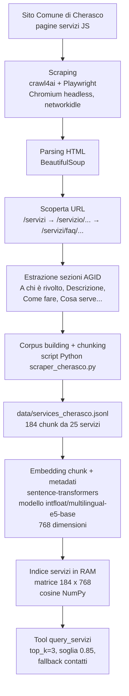

# Blueprint — Voicebot servizi comunali (Comune di Cherasco)

> Come è progettato il sistema: cosa fa, architettura, componenti, flussi, modello dati,
> approccio RAG, decisioni tecniche e motivazioni. Documento di riferimento unico.

Mappa rapida del documento:

| Domanda | Dove leggere |
|---|---|
| **Cosa stiamo costruendo** | §1 Cosa fa |
| **Perché lo stiamo costruendo così** | §2 principio guida, §9 decisioni tecniche, §11 costi/token |
| **Come funziona durante una chiamata** | §2 architettura runtime, §4 flussi runtime, §5 contratto tool |
| **Come siamo arrivati dai dati del sito al RAG** | §3 pipeline realizzata |
| **Con quali componenti** | §2 componenti, §6 struttura backend, §8 RAG |
| **Con quali dati** | §3 corpus, §7 modello dati, §8 vettori/metadati |
| **Con quali vincoli** | §9 decisioni, §11 costi/token, §13 limiti |
| **Come si testa** | §10 controlli di qualità |
| **Come si evolve** | §13 limiti e miglioramenti futuri |

## 1. Cosa fa

Assistente vocale in italiano per i servizi del Comune di Cherasco. Due casi d'uso:

1. **Q&A sui servizi comunali** — il cittadino chiede informazioni; l'assistente risponde sulla base
   dei contenuti del sito comunale (recupero semantico).
2. **Appuntamenti allo sportello** — verifica degli orari disponibili e prenotazione.

La voce e la conversazione sono gestite da Vapi. La conoscenza dei servizi e la logica degli
appuntamenti vivono in un backend FastAPI separato, interrogato dall'assistente tramite tool durante
la chiamata. Il backend è esposto in locale via ngrok.

Accanto ai due casi d'uso vocali, il backend offre una terza superficie non vocale: un **pannello
web di sola lettura** (`/admin/appointments`) per consultare gli appuntamenti prenotati, pensato per
l'operatore dello sportello. Copre l'elemento aggiuntivo richiesto dal test ("frontend per
visualizzare gli appuntamenti"). Dettaglio in §6.1.

## 2. Architettura del prodotto (runtime)

**Principio guida: Vapi parla; il backend sa e decide.** Vapi orchestra voce + modello linguistico +
instradamento dei tool e **formula la risposta parlata**. Il backend è un **retriever + gestore
appuntamenti**: recupera dati e applica regole, ma **non contiene un modello generativo a runtime**.



**Componenti:**
- **Assistente vocale (Vapi):** trascrizione Deepgram in italiano, modello GPT-4.1, voce italiana,
  instradamento verso i tool.
- **Backend (FastAPI):** espone gli endpoint chiamati dai tool. Contiene recupero semantico e logica
  appuntamenti. Nessun modello generativo.
- **Corpus servizi (`services_cherasco.jsonl`):** file testuale generato dallo scraper. Contiene
  184 chunk reali estratti da 25 servizi del sito di Cherasco. Ogni chunk ha testo, servizio,
  sezione, fonte e data aggiornamento se disponibile.
- **Indice dei servizi:** matrice `184 x 768` di vettori densi E5 costruita dal backend a partire
  dal corpus; resta in memoria RAM e viene interrogata con cosine similarity in NumPy. Non è SQLite,
  non è Supabase e non è un vector database esterno. FAISS resta un'evoluzione se il corpus cresce.
- **Database appuntamenti (SQLite):** salva solo appuntamenti, codici di conferma e slot occupati.
- **Pannello prenotazioni (`/admin/appointments`):** pagina HTML generata lato server (Jinja2) che
  elenca gli appuntamenti del database in sola lettura, con filtri per intervallo di date e categoria
  di servizio. Non chiama Vapi, non genera nulla: legge dal repository e rende una tabella. Vive nel
  backend per riusare lo stesso accesso ai dati degli endpoint vocali.

Il confine netto rende **tutta** la logica (RAG, regole, persistenza) testabile in isolamento e
indipendente dal vendor vocale.

### Lettura semplice dell'architettura

Ci sono due memorie diverse:

| Memoria | Cosa contiene | Dove vive | Quando viene usata |
|---|---|---|---|
| **SQLite** | appuntamenti prenotati | file locale `data/appointments.db` | quando Vapi chiede disponibilità o crea un appuntamento |
| **Indice servizi** | vettori dei testi comunali + riferimento al testo originale | RAM del backend, costruito alla prima chiamata RAG | quando Vapi chiama `query_servizi` |

Il backend non "decodifica" i vettori in parole. Ogni vettore resta collegato al suo testo originale:
quando il backend trova un vettore simile alla domanda, recupera il **chunk testuale originale** e lo
manda a Vapi. Vapi usa GPT-4.1 per trasformare quei chunk in una risposta parlata.

Il percorso del corpus è configurabile con `RAG_CORPUS_PATH`: per la demo reale va puntato a
`data/services_cherasco.jsonl`; `data/fallback_services.jsonl` resta un corpus statico di sicurezza.

## 3. Pipeline realizzata (da sito web a indice RAG)

Questa è la parte costruita per arrivare dalla fonte pubblica del Comune ai chunk interrogabili dal
backend. È separata dal flusso runtime: gira offline o alla prima chiamata RAG.



| Azione fatta | Strumento usato | File/modulo | Output |
|---|---|---|---|
| Aprire pagine renderizzate dal sito | `crawl4ai` + Playwright/Chromium | `ingestion/scraper_cherasco.py` | HTML completo dopo JavaScript |
| Trovare categorie e pagine servizio | BeautifulSoup + regex URL | `scraper_cherasco.py` | 25 URL `/servizi/faq/...` |
| Estrarre contenuti utili | BeautifulSoup su sezioni AGID | `_estrai_sezioni()` | testo per sezione servizio |
| Costruire chunk e metadati | Python script | `scraper_cherasco.py` | `testo`, `servizio`, `sezione`, `fonte`, `aggiornato` |
| Scartare stub boilerplate | filtro a regole | `ingestion/pulizia.py` | 14 rinvii vuoti all'ufficio rimossi (198→184) |
| Salvare corpus persistente | JSONL | `data/services_cherasco.jsonl` | 184 righe, una per chunk |
| Preparare testo da embeddare | Python dataclass `Chunk` | `services/rag/corpus.py` | `servizio — sezione: testo` |
| Creare embedding | `sentence-transformers` + `intfloat/multilingual-e5-base` | `services/rag/embedder.py` | vettori densi a 768 dimensioni |
| Costruire indice | NumPy | `services/rag/index.py` | matrice `184 x 768` in RAM |
| Cercare risposte | cosine similarity + gate | `services/rag/retriever.py` | chunk pertinenti o fallback contatti |

Nota importante: il file persistente è il JSONL con i chunk testuali. I vettori non vengono salvati
su disco: vengono ricostruiti in RAM alla prima chiamata RAG e rimangono in cache finché il backend è
attivo.

Ogni chunk porta anche metadati, oltre al testo grezzo trasformato in vettore. In particolare
`servizio` e `sezione` vengono usati **prima** dell'embedding per dare contesto al vettore; `fonte` e
`aggiornato` restano fuori dal vettore e vengono usati nell'output verso Vapi.

## 4. Flussi runtime

### Prenotazione (runtime)


### Recupero informazioni (runtime)

Questo è il flusso quando il cittadino chiede, per esempio: "Come funziona la TARI?"

1. **Il cittadino parla.** Vapi trascrive la frase in testo.
2. **Vapi sceglie il tool `query_servizi`.** Invia al backend la domanda come corpo JSON
   `{ "domanda": "..." }`.
3. **Il backend valida la domanda.** Se manca o è malformata, restituisce un `result` con
   `{"esito":"errore",...}`.
4. **Il backend crea l'embedding della domanda.** Usa un modello di embedding locale, non GPT-4.1.
   Un embedding è una lista di numeri che rappresenta il significato della frase.
5. **Il backend cerca i vettori più vicini.** Confronta il vettore della domanda con i vettori dei
   chunk del corpus usando cosine similarity in NumPy.
6. **Il backend applica una soglia (0.85, tarata su eval set reale).** Se il risultato migliore è
   troppo debole, restituisce `{"esito":"non_disponibile", "contatto": {...}}` con telefono e link
   prenotazione: Vapi dice che non ha l'informazione e indirizza al Comune. Meglio che inventare.
7. **Il backend restituisce i chunk originali.** Non genera una risposta finale; restituisce testo
   compatto + fonte.
8. **Vapi formula la risposta parlata.** GPT-4.1 usa solo quei chunk per rispondere al cittadino.

### Dall'acquisizione all'indice (riepilogo tecnico)
```
scraping (crawl4ai + Playwright) → corpus building (BeautifulSoup + metadata AGID)
   → chunking → embedding multilingue → indice in memoria (cosine NumPy)
```
Lo **scraping** estrae il contenuto grezzo; il **corpus building** lo trasforma in una base testuale
pulita e taggata (artefatto intermedio da cui si fa il chunking). Sono due step distinti.

Il sito di Cherasco carica contenuti via JavaScript, quindi lo scraper usa `crawl4ai` con Playwright
(Chromium headless) e aspetta `networkidle`: scaricare solo HTML con `httpx` non basta. Dopo il
render, BeautifulSoup estrae link e sezioni.

| Step | Chi lo fa | Output |
|---|---|---|
| Scoperta URL | `ingestion/scraper_cherasco.py` | pagina `/servizi` → categorie `/servizio/...` → 25 pagine `/servizi/faq/...` |
| Estrazione sezioni | `crawl4ai` + Playwright + BeautifulSoup | sezioni AGID: "A chi è rivolto", "Descrizione", "Come fare", ecc. |
| Corpus building / chunking | `scraper_cherasco.py` | `data/services_cherasco.jsonl`, 184 righe: un chunk per sezione utile |
| Embedding dei chunk | backend alla prima chiamata RAG, tramite `services/rag/embedder.py` | matrice `184 x 768` di vettori densi |
| Ricerca | backend a runtime, tramite `services/rag/index.py` e `retriever.py` | top 3 chunk sopra soglia |

Formato di un chunk:

```json
{
  "testo": "Lo Sportello Unico Attività Produttive...",
  "servizio": "Sportello Unico Attività Produttive (SUAP)",
  "sezione": "Descrizione",
  "fonte": "Comune di Cherasco — https://...",
  "aggiornato": ""
}
```

`servizio` e `sezione` entrano anche nel testo da embeddare (`servizio — sezione: testo`) perché
disambiguano frasi generiche come "verificare i costi sul portale". `fonte` e `aggiornato` non
entrano nell'embedding: servono per trasparenza e freschezza del dato.

## 5. Contratto dei tool

Ogni tool Vapi (API Request) ha il proprio `server.url`, un endpoint del backend. Il contratto è
JSON semplice: Vapi manda in POST gli argomenti estratti dalla conversazione, il backend risponde
con il risultato grezzo, senza envelope. Il router (`routers/tools.py`) riceve `payload: dict` e
lo passa al service.

```text
IN  (Vapi → backend):  { "domanda": "..." }
OUT (backend → Vapi):  { "esito": "ok", "risultati": [ {…} ] }
```

| Endpoint | corpo della richiesta | `result` | Service |
|---|---|---|---|
| `POST /tools/query_servizi` | `{ "domanda": str }` | top-k chunk rilevanti (testo + fonte) | `services/rag/retriever.py` |
| `POST /tools/disponibilita` | `{ "servizio", "data" }` | slot liberi / "pieno" | `services/appointments/booking.py` |
| `POST /tools/crea_appuntamento` | `{ "servizio", "data", "ora", "nome" }` | conferma + codice, oppure errore | `services/appointments/booking.py` |

La validazione Pydantic (`AvailabilityRequest`, `AppointmentRequest`, `QueryRequest` in `models/`)
avviene dentro il service, non nel router: in caso di input mancante o malformato il service
intercetta l'errore di validazione e restituisce `{"esito":"errore","motivo":…}` invece di
sollevare un'eccezione HTTP.

`query_servizi` restituisce **chunk compatti**, non una frase pronta: la formulazione resta a Vapi
(confine retriever/generatore), e risultati compatti proteggono il budget voce.

> **Ambiguità "check appointment"** (dal test): `crea_appuntamento` copre la creazione; la
> *consultazione* di una prenotazione esistente per codice sarebbe un endpoint opzionale
> `verifica_appuntamento`. Fuori scope per ora — candidato a domanda di chiarimento a CAI.

Gli errori logici (input incompleto, slot occupato) **non** restituiscono HTTP 4xx ma un `result`
con `{"esito":"errore","motivo":…}`: Vapi deve sempre ricevere un risultato da pronunciare.

## 6. Struttura del backend

Molti file piccoli, una responsabilità ciascuno (200–400 righe tipiche).

```text
backend/app/
├── main.py                 # crea l'app FastAPI, monta i router
├── config.py               # env var validate (pydantic-settings)
├── deps.py                 # dependency injection (repository) — override-abile nei test
├── routers/
│   ├── health.py           # GET /health
│   ├── tools.py            # POST /tools/disponibilita · /crea_appuntamento · /query_servizi
│   └── admin.py            # GET /admin/appointments — pannello prenotazioni (sola lettura)
├── templates/              # appointments.html — pagina Jinja2 del pannello
├── models/                 # Pydantic = validazione al confine, usata dentro i service
│   ├── appointment.py      #   AvailabilityRequest, AppointmentRequest
│   └── rag.py              #   QueryRequest per query_servizi
├── services/               # IL CUORE (logica pura, zero HTTP/Vapi)
│   ├── rag/                #   corpus · embedder · index · retriever
│   └── appointments/       #   repository.py (Repository Pattern) · booking.py
└── db/                     # schema.sql · session.py (SQLite)

ingestion/                  # OFFLINE: scrape → corpus → build_index (deps pesanti, separate)
tests/                      # unit + contratto + mini eval RAG
```

`ingestion/` è separata dal runtime: usa librerie pesanti (crawl4ai) e gira offline, così il servizio
resta leggero e il confine "retriever" è evidente.

### 6.1 Pannello prenotazioni (`/admin/appointments`)

Frontend minimale di sola lettura per consultare gli appuntamenti registrati. Risponde all'elemento
aggiuntivo del test ("piccolo frontend per visualizzare gli appuntamenti prenotati").

| Aspetto | Scelta | Perché |
|---|---|---|
| Rendering | HTML server-side con Jinja2 | nessun build step, nessun framework JS, una sola pagina |
| Rotta | `GET /admin/appointments` in `routers/admin.py` | thin: legge i parametri, valida, chiama il repository, rende il template |
| Dati | `AppointmentRepository.list_all(data_da, data_a, servizio)` | riusa il Repository Pattern già esistente; query SQL parametrizzata |
| Filtri | intervallo di date + categoria di servizio | i due tagli utili per un operatore; la categoria usa l'elenco fisso in `config.py` |
| Vincolo date | il campo "Al" non può precedere "Dal" | `min` lato server più un piccolo script inline che lo sincronizza in tempo reale |
| Accesso | nessuna autenticazione | demo con dati fittizi su repository pubblica; il meccanismo HTTP Basic era stato previsto e poi rimosso per semplicità (vedi NOTA_SCELTE_LIMITI) |

Il pannello non introduce logica nuova: legge dallo stesso repository degli endpoint vocali e si
limita a presentare i dati. Resta dentro il principio "il backend sa; qui mostra ciò che sa".

## 7. Modello dati

Validazione Pydantic al confine: non ci si fida dell'input dell'LLM (campi mancanti, formati strani).

| Modello | Campi | Nota |
|---|---|---|
| `AvailabilityRequest` | `servizio`, `data` | valida data ISO |
| `AppointmentRequest` | `servizio`, `data`, `ora`, `nome` | valida data ISO + ora `HH:MM`; rifiuta input incompleto |
| `QueryRequest` | `domanda` | valida il tool `query_servizi`; rifiuta domanda mancante o non testuale |

**Tabella `appointments` (SQLite):** `id`, `codice` (UNIQUE), `servizio`, `data`, `ora`, `nome`,
`stato`, `created_at`, con **`UNIQUE(servizio, data, ora)`**. Il vincolo unico è il lock atomico
anti doppia-prenotazione: la garanzia sta nel database, non nel codice.

## 8. RAG — retriever (non generatore)

L'LLM generativo è già in Vapi (GPT-4.1); il backend fa **solo recupero** e restituisce i chunk
rilevanti come `result`. Si saltano così gli step "generation/serving" della teoria RAG, con meno
latenza, meno costo e meno codice.

### Cosa significa "embedding" qui

Il modello di embedding non conversa e non scrive risposte. Fa solo una trasformazione:

```text
testo → vettore numerico
```

Lo strumento concreto è `sentence-transformers` con modello `intfloat/multilingual-e5-base`.
Ogni embedding prodotto da questo modello ha **768 dimensioni**.

Perché E5:
- è multilingue e funziona bene con query e testi in italiano;
- gira in locale, quindi non consuma token/API esterne e non invia contenuti comunali fuori dal backend;
- ha qualità adeguata per retrieval semantico su testi brevi di servizi pubblici;
- è più adatto al caso d'uso rispetto a modelli piccoli English-centric come `all-MiniLM`;
- resta semplice da usare con `sentence-transformers`, senza introdurre LangChain, vector DB o servizi gestiti.

Usiamo lo stesso tipo di trasformazione in due momenti:

1. **Alla prima chiamata RAG:** i chunk dei servizi diventano vettori e vengono tenuti in memoria.
2. **A ogni domanda:** la domanda del cittadino diventa un vettore temporaneo, usato solo per cercare.

La domanda dell'utente non viene salvata nel database. Serve solo come input momentaneo per trovare i
chunk più simili.

### Come usiamo i metadati

Ogni chunk ha cinque campi:

| Campo | Entra nell'embedding? | A cosa serve |
|---|---|---|
| `testo` | sì | contenuto informativo principale |
| `servizio` | sì | disambigua il servizio, es. SUAP, certificati, stato civile |
| `sezione` | sì | disambigua il tipo di informazione, es. costi, documenti, contatti |
| `fonte` | no | permette a Vapi di citare o verificare la provenienza |
| `aggiornato` | no | traccia la freschezza del dato quando disponibile |

Il testo effettivamente embeddato unisce paragrafo e metadati nel formato:

```text
servizio — sezione: testo
```

Questa scelta aumenta il contesto semantico senza usare un LLM. Non tutte le implementazioni RAG
minime lo fanno: molte embeddano solo il testo grezzo. Qui i metadati sono una scelta pratica per
ridurre ambiguità e migliorare il recupero, restando semplice.

### Dove sono salvati i vettori

Nella prima implementazione non c'è un database vettoriale. I dati sono separati così:

| Dato | Persistenza |
|---|---|
| Testi dei servizi | `data/services_cherasco.jsonl` (184 chunk) o fallback statico |
| Vettori dei servizi | RAM del backend, ricostruiti alla prima chiamata/avvio del processo |
| Appuntamenti | SQLite |

Questa scelta è intenzionale: per 184 chunk una matrice NumPy in memoria è più semplice di Supabase,
FAISS o un vector DB. Il caricamento reale richiede circa 8 secondi perché carica E5 e costruisce la
matrice; poi l'indice resta in cache per tutta la vita del processo. Se il corpus cresce molto, il
miglioramento naturale è salvare l'indice su file (`.npz`) o passare a FAISS.

**Scelte concrete:**
| Componente | Scelta | Perché |
|---|---|---|
| Ingestion | `crawl4ai` + Playwright + BeautifulSoup | il sito usa JavaScript; serve HTML renderizzato |
| Chunking | un chunk per sezione AGID utile | semplice e leggibile: 184 chunk da 25 servizi |
| Embedding | `sentence-transformers` + `intfloat/multilingual-e5-base` | multilingue/italiano, locale, zero token LLM, 768 dimensioni |
| Indice | **cosine in NumPy, in memoria** | 184 chunk → scan lineare esatto e veloce. FAISS = upgrade se il corpus cresce |
| Retrieval | dense, cosine, **top_k=3**, soglia **0.85**, cap caratteri 2000 | compatto per la voce e per i crediti Vapi |
| Fallback | contatto Comune + URL prenotazione da config | se il corpus non copre la domanda, Vapi indirizza al Comune invece di inventare |
| Grounding | prompt "usa solo il contesto; se non c'è, dillo; non inventare; cita la fonte" | anti-allucinazione, vive nel prompt Vapi |
| Sanity-check | eval set 15 Q&A sul corpus reale | soglia scelta con evidenza, non a sentimento |

> **Disciplina E5** (con `multilingual-e5-base`): prefissare `query:` per le domande e `passage:` per
> i testi indicizzati, e **normalizzare** (L2) gli embedding prima della cosine. Saltarlo degrada il
> recupero. Con `bge-m3` i prefissi non servono.

### Output di `query_servizi`

Il tool non risponde con una frase pronta. Risponde con materiale verificabile:

```json
{
  "esito": "ok",
  "risultati": [
    {
      "servizio": "Tassa sui rifiuti (TARI)",
      "sezione": "Descrizione",
      "testo": "Tassa sui rifiuti (TARI)...",
      "fonte": "Comune di Cherasco - Ufficio Tributi"
    }
  ]
}
```

Questo formato tiene basso il costo: pochi chunk, testo breve, fonte inclusa. Vapi riceve il contesto
minimo necessario e genera la frase vocale.

Se nessun chunk supera la soglia:

```json
{
  "esito": "non_disponibile",
  "contatto": {
    "telefono": "0172.427010",
    "prenotazione_url": ""
  }
}
```

La soglia `0.85` è stata tarata sul corpus **pulito** (184 chunk, dopo rimozione degli stub
boilerplate — vedi `ingestion/pulizia.py`) e su un eval set di 14 domande (8 in-dominio, 6 fuori):
match in-dominio reali fra `0.855` e `0.896`, fuori-dominio `≤0.840` (passaporto `0.838`, carta
d'identità `0.840`, TARI `0.814`). `0.85` cade nel gap pulito (`0.840 ↔ 0.855`) e non produce falsi
positivi. La soglia privilegia precisione e prudenza: per un Comune è meglio dire "non ho questa
informazione" che dare una risposta sbagliata. Carta d'identità/passaporto/TARI **non sono schede nel
corpus Cherasco** (gap di contenuto): cadono nel fallback contatti, correttamente. Limite di recall
noto: "aprire un'attività commerciale" si ferma a `0.822` (il SUAP usa "attività produttive"):
mismatch di vocabolario, non risolvibile con la soglia.

**Cosa NON facciamo ora** (scelta consapevole di dimensionamento, = "miglioramenti con più tempo"):
reranking (cross-encoder), hybrid (dense+BM25), LangChain/LlamaIndex, vector DB esterni
(Qdrant/Milvus), agentic/multimodal, serving TEI/TGI. Per un Comune piccolo sono overkill.

## 9. Decisioni tecniche & motivazioni

| Decisione | Perché |
|---|---|
| **Logica nel backend, non in Vapi** | Vapi è orchestratore voce; tenere RAG/regole/persistenza fuori rende il sistema testabile in isolamento e indipendente dal vendor. |
| **Tool atomici** (3 endpoint, una responsabilità) | l'LLM li sceglie meglio e gli edge case restano isolati. |
| **Deepgram `language: it`** (non `multi`) | bot solo-italiano: fissare la lingua è più accurato dell'auto-detect. |
| **GPT-4.1** | buon italiano + latenza accettabile nel budget voce; declassabile se la latenza diventa il collo di bottiglia. |
| **Recupero senza secondo LLM** | la generazione è già in Vapi: niente modello generativo nel backend, quindi costo e latenza minori. |
| **cosine NumPy, non FAISS** | semplice e veloce su 184 chunk; FAISS documentato come upgrade se il corpus cresce. |
| **SQLite** | persistenza reale (oltre l'in-memory richiesto) con zero overhead operativo. |
| **`UNIQUE` per l'anti doppia-prenotazione** | garanzia atomica nel DB; un prompt non potrebbe garantirla. |
| **Validazione al confine (Pydantic)** | l'input dell'LLM non è affidabile; si valida prima di toccare i dati. |
| **Fallback statico** | la demo non deve dipendere dalla riuscita live di scraping/index. |
| **Niente over-engineering** | no Squads/multi-agent, no reranking/vector DB, no numero telefonico reale, no HIPAA/ZDR: fuori scope, consumerebbero tempo/budget senza valore. |

## 10. Controlli di qualità (quality gates)

Controlli distribuiti lungo tutta la pipeline, dall'ingestione alla consegna:

| Area | Come viene verificata |
|---|---|
| **Contratto Vapi** | test sugli endpoint tool: corpo della richiesta e formato del `result` restituito |
| **Appuntamenti** | test su disponibilità, creazione, data futura, slot non valido e doppia prenotazione |
| **Database SQLite** | vincolo `UNIQUE` sugli slot occupati e test sugli edge case |
| **Corpus/RAG** | caricamento corpus, numero chunk atteso, query di smoke, soglia `0.85` su eval set |
| **Fallback** | test che sotto soglia ritorni `non_disponibile` + contatto Comune |
| **Pannello prenotazioni** | test su elenco, stato vuoto, filtri per data e categoria, intervallo invertito, data malformata |
| **Integrazione demo** | smoke test con backend locale esposto via ngrok e tool Vapi configurati |

- **Corpus building:** scarto pagine vuote/brevi, solo italiano, dedup, rimozione boilerplate; ogni
  unità con fonte + data.
- **Indicizzazione:** indice si carica, n. chunk atteso, query di smoke ok.
- **Recupero (il più importante):** soglia di similarità; sotto soglia il backend risponde
  "informazione non disponibile" invece di rispondere male.
- **Confine tool:** validazione Pydantic, rifiuto input malformati, timeout.
- **Appuntamenti:** data/ora valide e future, slot esistente, lock anti doppia-prenotazione.
- **Pre-consegna:** unit test + mini eval set devono passare.

## 11. Costi / token

Due livelli distinti:
- **Crediti Vapi** (budget reale, ~10 crediti ≈ ~90 min di test): influenzati indirettamente dal
  backend. Difesi da **risposte tool veloci** (<1–2 s, embedding locali, niente API esterne) e
  **`result` compatti** (top_k=3, chunk già ripuliti → meno token per turno nel contesto dell'LLM).
- **Token del backend ≈ zero per scelta:** embedding locali, nessun LLM a runtime. Unico punto di
  spesa possibile, offline e opzionale: un LLM per ripulire il markdown scrapato — evitabile con
  pulizia a regole.

## 12. Configurazione dell'assistente Vapi

Da importare/ricreare su Vapi (export in `vapi/assistant.json`, con chiavi/ID rimossi):
- **Modello:** GPT-4.1 · **Trascrizione:** Deepgram, lingua italiano · **Voce:** italiana
- **Primo messaggio + system prompt** in italiano; il prompt impone di rispondere **solo** sui dati
  recuperati dai tool e di non inventare orari o procedure.
- **Tre tool API Request** verso gli endpoint `/tools/*`; l'URL è quello di ngrok, da aggiornare a
  ogni riavvio del tunnel.

## 13. Limiti noti e miglioramenti futuri

**Limiti:** l'URL ngrok cambia a ogni riavvio (va riaggiornato nei tool); l'acquisizione dipende dalla
struttura del sito comunale; il budget del trial vocale è limitato (test mirati).

**Con più tempo:** reranking con cross-encoder su una KB più ampia; recupero ibrido per match esatti
(codici, nomi uffici); deploy stabile del backend (no ngrok in demo); set di valutazione del recupero
più ampio; estrazione dati strutturati post-call; estensione del pannello ai log delle conversazioni
(il pannello appuntamenti è già realizzato, vedi §6.1) e containerizzazione.

## 14. Strumenti di AI usati

Sviluppo assistito da Claude (Anthropic) per progettazione e documentazione. Gli embedding usano
modelli open-source della famiglia sentence-transformers. A runtime il backend non invia contenuti a
servizi esterni: il recupero avviene in locale.
