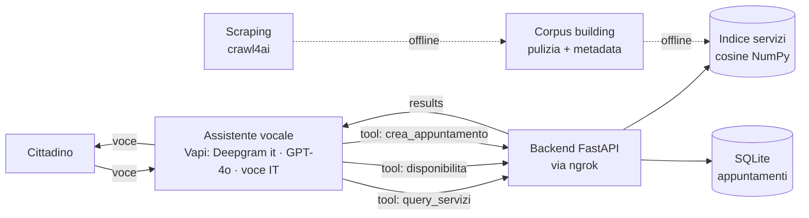
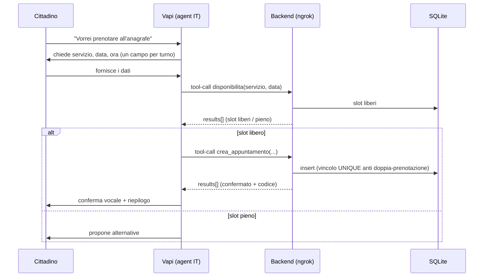

# Blueprint — Voicebot servizi comunali (Comune di Codroipo)

> Come è progettato il sistema: cosa fa, architettura, componenti, flussi, modello dati,
> approccio RAG, decisioni tecniche e motivazioni. Documento di riferimento unico.
> Per stato e prossimi passi vedi [ROADMAP.md](ROADMAP.md).

## 1. Cosa fa

Assistente vocale in italiano per i servizi del Comune di Codroipo. Due casi d'uso:

1. **Q&A sui servizi comunali** — il cittadino chiede informazioni; l'assistente risponde sulla base
   dei contenuti del sito comunale (recupero semantico).
2. **Appuntamenti allo sportello** — verifica degli orari disponibili e prenotazione.

La voce e la conversazione sono gestite da Vapi. La conoscenza dei servizi e la logica degli
appuntamenti vivono in un backend FastAPI separato, interrogato dall'assistente tramite tool durante
la chiamata. Il backend è esposto in locale via ngrok.

## 2. Architettura

**Principio guida: Vapi parla; il backend sa e decide.** Vapi orchestra voce + modello linguistico +
instradamento dei tool e **formula la risposta parlata**. Il backend è un **retriever + gestore
appuntamenti**: recupera dati e applica regole, ma **non contiene un modello generativo a runtime**.



**Componenti:**
- **Assistente vocale (Vapi):** trascrizione Deepgram in italiano, modello GPT-4o, voce italiana,
  instradamento verso i tool.
- **Backend (FastAPI):** espone gli endpoint chiamati dai tool. Contiene recupero semantico e logica
  appuntamenti. Nessun modello generativo.
- **Indice dei servizi:** vettori dei contenuti del sito, costruiti offline; ricerca per similarità
  del coseno in memoria con NumPy (FAISS resta un'evoluzione se il corpus cresce).
- **Database appuntamenti (SQLite).**

Il confine netto rende **tutta** la logica (RAG, regole, persistenza) testabile in isolamento e
indipendente dal vendor vocale.

## 3. Flussi

### Prenotazione (runtime)


### Recupero informazioni (runtime)
La domanda viene vettorizzata, si recuperano i blocchi più vicini per similarità del coseno, si
applica una **soglia**; se il punteggio migliore è sotto soglia l'assistente dichiara che
l'informazione non è disponibile invece di inventarla. I blocchi recuperati tornano all'assistente,
che formula la risposta parlata.

### Dall'acquisizione all'indice (offline, una volta)
```
scraping (crawl4ai) → corpus building (pulizia, dedup, metadata fonte/sezione)
   → chunking → embedding multilingue → indice in memoria (cosine NumPy)
```
Lo **scraping** estrae il contenuto grezzo; il **corpus building** lo trasforma in una base testuale
pulita e taggata (artefatto intermedio da cui si fa il chunking). Sono due step distinti.

## 4. Contratto dei tool

Ogni tool Vapi (API Request) ha il proprio `server.url` → un endpoint. Tutti ricevono lo **stesso
envelope** e rispondono con lo **stesso formato**. Un `vapi_adapter` fa unwrap/rewrap; il router
delega al service.

```text
IN  (Vapi → backend):  { "message": { "type": "tool-calls",
                         "toolCallList": [ { "id", "name", "arguments": {…} } ] } }
OUT (backend → Vapi):  { "results": [ { "toolCallId": "<stesso id>", "result": <…> } ] }
```

| Endpoint | `arguments` | `result` | Service |
|---|---|---|---|
| `POST /tools/query_servizi` | `{ "domanda": str }` | top-k chunk rilevanti (testo + fonte) | `services/rag/retriever.py` |
| `POST /tools/disponibilita` | `{ "servizio", "data" }` | slot liberi / "pieno" | `services/appointments/booking.py` |
| `POST /tools/crea_appuntamento` | `{ "servizio", "data", "ora", "nome" }` | conferma + codice, oppure errore | `services/appointments/booking.py` |

`query_servizi` restituisce **chunk compatti**, non una frase pronta: la formulazione resta a Vapi
(confine retriever/generatore), e risultati compatti proteggono il budget voce.

> **Ambiguità "check appointment"** (dal test): `crea_appuntamento` copre la creazione; la
> *consultazione* di una prenotazione esistente per codice sarebbe un endpoint opzionale
> `verifica_appuntamento`. Fuori scope per ora — candidato a domanda di chiarimento a CAI.

Gli errori logici (input incompleto, slot occupato) **non** restituiscono HTTP 4xx ma un `result`
con `{"esito":"errore","motivo":…}`: Vapi deve sempre ricevere `results[]` da pronunciare.

## 5. Struttura del backend

Molti file piccoli, una responsabilità ciascuno (200–400 righe tipiche).

```text
backend/app/
├── main.py                 # crea l'app FastAPI, monta i router
├── config.py               # env var validate (pydantic-settings)
├── deps.py                 # dependency injection (repository) — override-abile nei test
├── vapi_adapter.py         # contratto Vapi ⇄ chiamate interne (unwrap/rewrap)
├── routers/
│   ├── health.py           # GET /health
│   └── tools.py            # POST /tools/disponibilita · /crea_appuntamento · /query_servizi
├── models/                 # Pydantic = validazione al confine
│   ├── vapi.py             #   ToolCall, ToolCallEnvelope
│   └── appointment.py      #   AvailabilityRequest, AppointmentRequest
├── services/               # IL CUORE (logica pura, zero HTTP/Vapi)
│   ├── rag/                #   embedder · index · retriever
│   └── appointments/       #   repository.py (Repository Pattern) · booking.py
└── db/                     # schema.sql · session.py (SQLite)

ingestion/                  # OFFLINE: scrape → corpus → build_index (deps pesanti, separate)
tests/                      # unit + contratto + mini eval RAG
```

`ingestion/` è separata dal runtime: usa librerie pesanti (crawl4ai) e gira offline, così il servizio
resta leggero e il confine "retriever" è evidente.

## 6. Modello dati

Validazione Pydantic al confine: non ci si fida dell'input dell'LLM (campi mancanti, formati strani).

| Modello | Campi | Nota |
|---|---|---|
| `ToolCallEnvelope` | `message.toolCallList[]` | parsing payload Vapi; `arguments` accettato come oggetto **o** stringa JSON |
| `AvailabilityRequest` | `servizio`, `data` | valida data ISO |
| `AppointmentRequest` | `servizio`, `data`, `ora`, `nome` | valida data ISO + ora `HH:MM`; rifiuta input incompleto |

**Tabella `appointments` (SQLite):** `id`, `codice` (UNIQUE), `servizio`, `data`, `ora`, `nome`,
`stato`, `created_at`, con **`UNIQUE(servizio, data, ora)`**. Il vincolo unico è il lock atomico
anti doppia-prenotazione: la garanzia sta nel database, non nel codice.

## 7. RAG — retriever (non generatore)

L'LLM generativo è già in Vapi (GPT-4o); il backend fa **solo recupero** e restituisce i chunk
rilevanti come `result`. → Meno latenza, meno costo, meno codice: si saltano gli step
"generation/serving" della teoria RAG.

**Scelte concrete:**
| Componente | Scelta | Perché |
|---|---|---|
| Ingestion | **crawl4ai** | scraping mirato del sito di Codroipo (lista URL, non crawler profondo) |
| Chunking | ~250-350 token, overlap ~10%, con metadata (fonte/sezione) | chunk corti = risposte vocali mirate; valori di partenza, da validare sull'eval set |
| Embedding | `intfloat/multilingual-e5-base` (o `BAAI/bge-m3`) | multilingue/italiano, open-source, locale. Dep pesante (~400MB): caricare il modello all'avvio |
| Indice | **cosine in NumPy, in memoria** | ~100 chunk di un Comune → scan lineare esatto e istantaneo. FAISS = upgrade quando il corpus cresce (right-sizing) |
| Retrieval | dense, cosine, **top_k=3** + gate soglia + cap caratteri (~1800-2500) | compatto per la voce e per i crediti Vapi |
| Fallback | `fallback_services.jsonl` curato (6-10 servizi) | blinda la demo se scraping/index falliscono dal vivo |
| Grounding | prompt "usa solo il contesto; se non c'è, dillo; non inventare; cita la fonte" | anti-allucinazione, vive nel prompt Vapi |
| Sanity-check | mini eval set 5-10 Q&A | scegliere chunk/top_k con evidenza |

> **Disciplina E5** (con `multilingual-e5-base`): prefissare `query:` per le domande e `passage:` per
> i testi indicizzati, e **normalizzare** (L2) gli embedding prima della cosine. Saltarlo degrada il
> recupero. Con `bge-m3` i prefissi non servono.

**Cosa NON facciamo ora** (scelta consapevole di dimensionamento, = "miglioramenti con più tempo"):
reranking (cross-encoder), hybrid (dense+BM25), LangChain/LlamaIndex, vector DB esterni
(Qdrant/Milvus), agentic/multimodal, serving TEI/TGI. Per un Comune piccolo sono overkill.

## 8. Decisioni tecniche & motivazioni

| Decisione | Perché |
|---|---|
| **Logica nel backend, non in Vapi** | Vapi è orchestratore voce; tenere RAG/regole/persistenza fuori rende il sistema testabile in isolamento e indipendente dal vendor. |
| **Tool atomici** (3 endpoint, una responsabilità) | l'LLM li sceglie meglio e gli edge case restano isolati. |
| **Deepgram `language: it`** (non `multi`) | bot solo-italiano: fissare la lingua è più accurato dell'auto-detect. |
| **GPT-4o** | buon italiano + latenza accettabile nel budget voce; declassabile se la latenza diventa il collo di bottiglia. |
| **Recupero senza secondo LLM** | la generazione è già in Vapi: niente modello generativo nel backend → costo/latenza minori. |
| **cosine NumPy, non FAISS** | esatto e istantaneo su ~100 chunk, zero dipendenze; FAISS documentato come upgrade. |
| **SQLite** | persistenza reale (oltre l'in-memory richiesto) con zero overhead operativo. |
| **`UNIQUE` per l'anti doppia-prenotazione** | garanzia atomica nel DB; un prompt non potrebbe garantirla. |
| **Validazione al confine (Pydantic)** | l'input dell'LLM non è affidabile; si valida prima di toccare i dati. |
| **Fallback statico** | la demo non deve dipendere dalla riuscita live di scraping/index. |
| **Niente over-engineering** | no Squads/multi-agent, no reranking/vector DB, no numero telefonico reale, no HIPAA/ZDR: fuori scope, consumerebbero tempo/budget senza valore. |

## 9. Controlli di qualità (quality gates)

Controlli a ogni stadio, non solo a fine processo:
- **Corpus building:** scarto pagine vuote/brevi, solo italiano, dedup, rimozione boilerplate; ogni
  unità con fonte + data.
- **Indicizzazione:** indice si carica, n. chunk atteso, query di smoke ok.
- **Recupero (il più importante):** soglia di similarità → sotto soglia, "informazione non
  disponibile" invece di rispondere male.
- **Confine tool:** validazione Pydantic, rifiuto input malformati, timeout.
- **Appuntamenti:** data/ora valide e future, slot esistente, lock anti doppia-prenotazione.
- **Pre-consegna:** unit test + mini eval set devono passare.

## 10. Costi / token

Due livelli distinti:
- **Crediti Vapi** (budget reale, ~10 crediti ≈ ~90 min di test): influenzati indirettamente dal
  backend. Difesi da **risposte tool veloci** (<1–2 s, embedding locali, niente API esterne) e
  **`result` compatti** (top_k=3, chunk già ripuliti → meno token per turno nel contesto dell'LLM).
- **Token del backend ≈ zero per scelta:** embedding locali, nessun LLM a runtime. Unico punto di
  spesa possibile, offline e opzionale: un LLM per ripulire il markdown scrapato — evitabile con
  pulizia a regole.

## 11. Configurazione dell'assistente Vapi

Da importare/ricreare su Vapi (export in `vapi/assistant.json`, con chiavi/ID rimossi):
- **Modello:** GPT-4o · **Trascrizione:** Deepgram, lingua italiano · **Voce:** italiana
- **Primo messaggio + system prompt** in italiano; il prompt impone di rispondere **solo** sui dati
  recuperati dai tool e di non inventare orari o procedure.
- **Tre tool API Request** verso gli endpoint `/tools/*`; l'URL è quello di ngrok, da aggiornare a
  ogni riavvio del tunnel.

## 12. Limiti noti e miglioramenti futuri

**Limiti:** l'URL ngrok cambia a ogni riavvio (va riaggiornato nei tool); l'acquisizione dipende dalla
struttura del sito comunale; il budget del trial vocale è limitato (test mirati).

**Con più tempo:** reranking con cross-encoder su una KB più ampia; recupero ibrido per match esatti
(codici, nomi uffici); deploy stabile del backend (no ngrok in demo); set di valutazione del recupero
più ampio; estrazione dati strutturati post-call; frontend (appuntamenti + log) e containerizzazione.

## 13. Strumenti di AI usati

Sviluppo assistito da Claude (Anthropic) per progettazione e documentazione. Gli embedding usano
modelli open-source della famiglia sentence-transformers. A runtime il backend non invia contenuti a
servizi esterni: il recupero avviene in locale.
